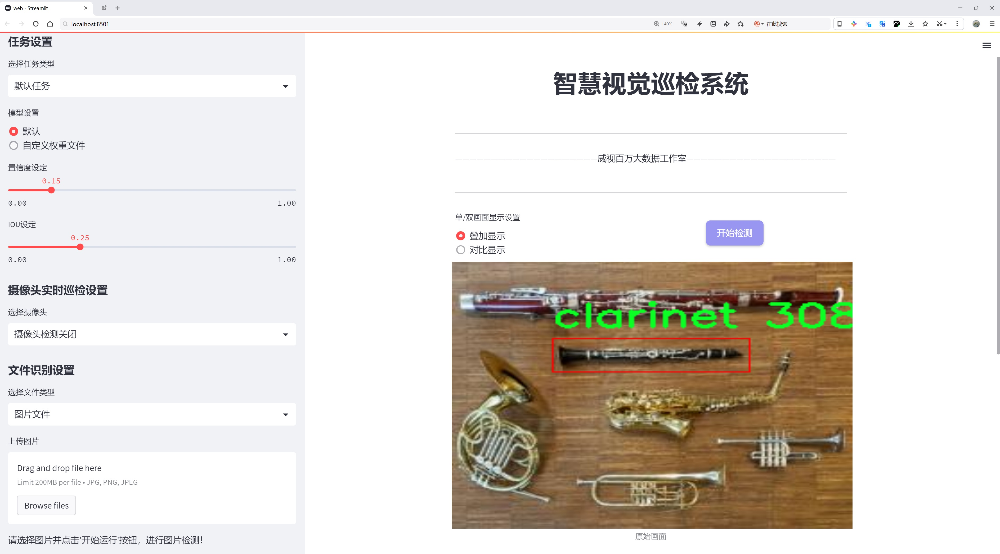
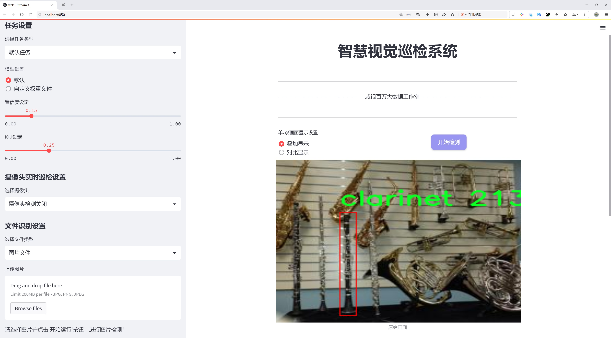
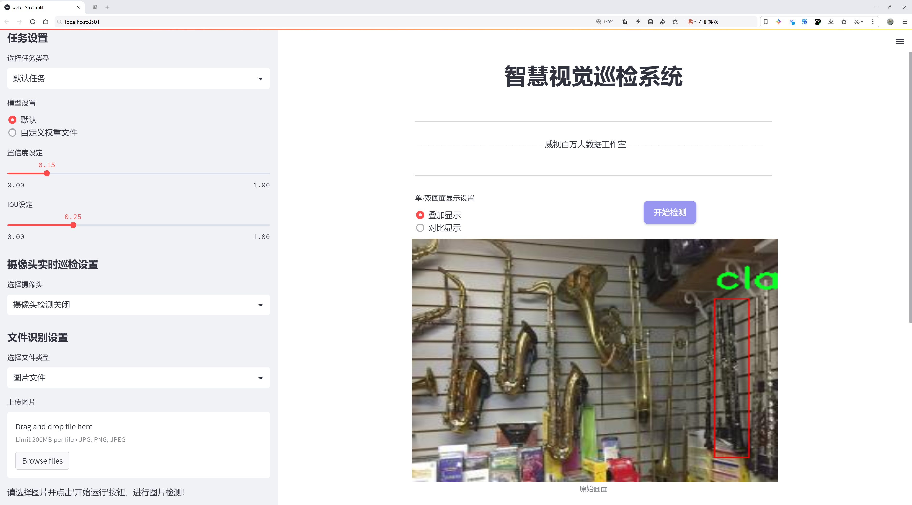
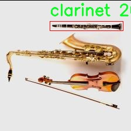
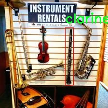
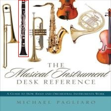
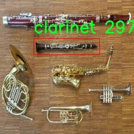

# 乐器检测检测系统源码分享
 # [一条龙教学YOLOV8标注好的数据集一键训练_70+全套改进创新点发刊_Web前端展示]

### 1.研究背景与意义

项目参考[AAAI Association for the Advancement of Artificial Intelligence](https://gitee.com/qunshansj/projects)

项目来源[AACV Association for the Advancement of Computer Vision](https://gitee.com/qunmasj/projects)

研究背景与意义

随着人工智能技术的迅猛发展，计算机视觉在各个领域的应用日益广泛，尤其是在物体检测方面。物体检测技术不仅能够提高生产效率，还能为各类智能系统提供重要的视觉信息支持。在音乐教育、乐器制造和音乐表演等领域，乐器的识别与分类显得尤为重要。尤其是对于单一乐器的检测，如单簧管（clarinet），其在乐器学习、演奏及管理中的应用需求不断增加。因此，基于改进YOLOv8的乐器检测系统的研究具有重要的理论价值和实际意义。

YOLO（You Only Look Once）系列模型以其高效的实时检测能力和较高的准确率，成为了物体检测领域的佼佼者。YOLOv8作为该系列的最新版本，进一步优化了模型的结构和算法，提升了检测精度和速度。然而，针对特定乐器的检测任务，现有的YOLOv8模型在数据集的适应性和特定类别的识别能力上仍存在一定的局限性。因此，改进YOLOv8以适应单簧管的检测任务，能够有效提升其在特定应用场景下的性能。

本研究选取了包含30张单簧管图像的数据集，虽然样本数量相对较少，但在乐器检测的初步研究中，这一数据集为模型的训练和验证提供了基础。通过对该数据集的深入分析和处理，可以为后续的乐器检测系统提供有效的模型训练方案。此外，单簧管作为一种常见的乐器，其在音乐教育和演出中的重要性使得对其进行准确检测的需求愈发迫切。通过构建一个高效的乐器检测系统，不仅能够提升乐器管理的智能化水平，还能为音乐教育提供更为精准的支持。

在实际应用中，乐器检测系统可以广泛应用于音乐教育机构、乐器商店、演出现场等场景。通过对乐器的自动识别，教师可以更好地管理学生的乐器使用情况，商店可以实现库存管理的智能化，而演出现场则可以通过实时检测提升演出效果。此外，该系统还可以为乐器的维修和保养提供数据支持，帮助相关人员及时发现乐器的问题，从而延长乐器的使用寿命。

综上所述，基于改进YOLOv8的乐器检测系统的研究，不仅能够推动物体检测技术在乐器领域的应用，还能为音乐教育和乐器管理提供重要的技术支持。通过不断优化和完善该系统，未来有望在更广泛的乐器种类和应用场景中实现高效的检测与识别，为音乐文化的传播和发展贡献力量。

### 2.图片演示







##### 注意：由于此博客编辑较早，上面“2.图片演示”和“3.视频演示”展示的系统图片或者视频可能为老版本，新版本在老版本的基础上升级如下：（实际效果以升级的新版本为准）

  （1）适配了YOLOV8的“目标检测”模型和“实例分割”模型，通过加载相应的权重（.pt）文件即可自适应加载模型。

  （2）支持“图片识别”、“视频识别”、“摄像头实时识别”三种识别模式。

  （3）支持“图片识别”、“视频识别”、“摄像头实时识别”三种识别结果保存导出，解决手动导出（容易卡顿出现爆内存）存在的问题，识别完自动保存结果并导出到tempDir中。

  （4）支持Web前端系统中的标题、背景图等自定义修改，后面提供修改教程。

  另外本项目提供训练的数据集和训练教程,暂不提供权重文件（best.pt）,需要您按照教程进行训练后实现图片演示和Web前端界面演示的效果。

### 3.视频演示

[3.1 视频演示](https://www.bilibili.com/video/BV1RktFeHEAc/)

### 4.数据集信息展示

##### 4.1 本项目数据集详细数据（类别数＆类别名）

nc: 1
names: ['clarinet']


##### 4.2 本项目数据集信息介绍

数据集信息展示

在本研究中，我们使用的数据集名为“Data Visualization Homework 3”，该数据集专门用于训练和改进YOLOv8模型，以实现对乐器的高效检测。乐器检测在音乐教育、乐器制造以及音频分析等领域中具有重要的应用价值，能够帮助我们更好地理解和分析乐器的特征与性能。在本项目中，我们的重点是对单一乐器——单簧管（clarinet）的检测进行深入研究。

“Data Visualization Homework 3”数据集的设计旨在提供丰富的图像样本，以支持YOLOv8模型的训练。该数据集包含的类别数量为1，具体类别为“clarinet”。这一设计选择使得模型能够专注于学习单簧管的特征，从而提高检测的准确性和效率。数据集中包含的图像样本多样，涵盖了不同的拍摄角度、光照条件和背景环境，这些因素对于模型的泛化能力至关重要。

在数据集中，单簧管的图像样本经过精心挑选，确保了每张图像都能清晰地展示乐器的形状、颜色和细节。这些图像不仅包括单簧管的全景图，还包含了特写镜头，突出了乐器的关键部件，如音孔、吹嘴和音管等。这种多样化的样本选择能够帮助YOLOv8模型学习到单簧管在不同环境下的表现，从而提升其在实际应用中的检测能力。

为了进一步增强数据集的有效性，我们还进行了数据增强处理。这包括对图像进行旋转、缩放、裁剪和颜色调整等操作，以模拟不同的拍摄条件和环境变化。这种数据增强策略不仅丰富了训练数据的多样性，还能有效防止模型过拟合，使其在面对未知数据时能够保持较高的检测性能。

在训练过程中，我们将“Data Visualization Homework 3”数据集与YOLOv8模型相结合，采用了适当的超参数设置和训练策略，以确保模型能够充分学习到单簧管的特征。通过反复迭代训练和验证，我们不断优化模型的性能，力求在准确性和实时性之间找到最佳平衡点。

总之，“Data Visualization Homework 3”数据集为本研究提供了坚实的基础，使得我们能够在乐器检测领域取得突破性进展。通过对单簧管的深入学习和分析，我们期望能够为乐器检测技术的发展贡献一份力量，同时为相关领域的研究者提供有价值的参考资料。随着YOLOv8模型的不断改进，我们相信在未来的应用中，乐器检测的准确性和效率将得到显著提升，从而推动音乐教育和乐器产业的进一步发展。










### 5.全套项目环境部署视频教程（零基础手把手教学）

[5.1 环境部署教程链接（零基础手把手教学）](https://www.ixigua.com/7404473917358506534?logTag=c807d0cbc21c0ef59de5)


[5.2 安装Python虚拟环境创建和依赖库安装视频教程链接（零基础手把手教学）](https://www.ixigua.com/7404474678003106304?logTag=1f1041108cd1f708b01a)

### 6.手把手YOLOV8训练视频教程（零基础小白有手就能学会）

[6.1 手把手YOLOV8训练视频教程（零基础小白有手就能学会）](https://www.ixigua.com/7404477157818401292?logTag=d31a2dfd1983c9668658)

### 7.70+种全套YOLOV8创新点代码加载调参视频教程（一键加载写好的改进模型的配置文件）

[7.1 70+种全套YOLOV8创新点代码加载调参视频教程（一键加载写好的改进模型的配置文件）](https://www.ixigua.com/7404478314661806627?logTag=29066f8288e3f4eea3a4)

### 8.70+种全套YOLOV8创新点原理讲解（非科班也可以轻松写刊发刊，V10版本正在科研待更新）

由于篇幅限制，每个创新点的具体原理讲解就不一一展开，具体见下列网址中的创新点对应子项目的技术原理博客网址【Blog】：


[8.1 70+种全套YOLOV8创新点原理讲解链接](https://gitee.com/qunmasj/good)

### 9.系统功能展示（检测对象为举例，实际内容以本项目数据集为准）

图9.1.系统支持检测结果表格显示

  图9.2.系统支持置信度和IOU阈值手动调节

  图9.3.系统支持自定义加载权重文件best.pt(需要你通过步骤5中训练获得)

  图9.4.系统支持摄像头实时识别

  图9.5.系统支持图片识别

  图9.6.系统支持视频识别

  图9.7.系统支持识别结果文件自动保存

  图9.8.系统支持Excel导出检测结果数据


### 10.原始YOLOV8算法原理

原始YOLOv8算法原理

YOLOv8是Ultralytics公司在2023年推出的目标检测算法，作为YOLO系列的最新版本，它在前几代算法的基础上进行了显著的改进和创新，旨在提供更高的检测精度和更快的推理速度。YOLOv8的设计理念强调快速、准确和易于使用，使其在目标检测、图像分割和图像分类等多种任务中都表现出色。其网络结构主要由输入层、主干网络、Neck部分和输出层四个模块组成，每个模块都经过精心设计，以实现最佳的性能。

在输入层，YOLOv8默认的输入图像尺寸为640x640，但考虑到实际应用中图像长宽比的多样性，YOLOv8采用了自适应图片缩放技术。这种技术通过将图像的长边按比例缩小到指定尺寸，并对短边进行填充，从而减少信息冗余，提升目标检测和推理的速度。此外，YOLOv8在训练过程中引入了Mosaic数据增强技术，该技术通过随机选择四张图像进行缩放和拼接，生成新的训练样本。这种方法不仅丰富了训练数据，还迫使模型学习不同位置和周围像素的特征，从而有效提高了模型的预测精度。

YOLOv8的主干网络部分是其核心组成部分，采用了C2F模块替代了YOLOv5中的C3模块。C2F模块的设计灵感来源于YOLOv7中的ELAN模块，通过并行化更多的梯度流分支，C2F模块在保证轻量化的同时，能够获取更丰富的梯度信息，从而提高模型的精度和响应速度。这一设计使得YOLOv8在特征提取的过程中，能够更好地捕捉到不同尺度的目标特征，为后续的检测任务奠定了坚实的基础。

在Neck部分，YOLOv8进一步优化了特征融合的方式。与YOLOv5相比，YOLOv8去除了两次上采样之前的1x1卷积连接层，直接对主干网络不同阶段输出的特征进行上采样。这种简化的结构不仅提高了特征融合的效率，还减少了计算复杂度，使得YOLOv8在推理时能够更快地处理输入数据。

YOLOv8的输出层是其创新之处，采用了Decoupled-Head结构，取代了YOLOv5中的Coupled-Head结构。在新的设计中，检测和分类的卷积操作被解耦，输入特征图首先通过两个1x1卷积模块进行降维，然后分别进行类别预测和边界框位置预测。这种解耦设计使得模型在处理复杂场景时，能够更好地平衡分类和回归任务的性能。此外，YOLOv8在损失函数的设计上也进行了创新，取消了Obj分支，分类分支依然采用二值交叉熵损失，而边界框回归分支则使用了分布焦点损失和CIoU损失。这种损失函数的组合，旨在使网络模型快速聚焦于标签附近的数值，提高了模型的训练效率和预测精度。

YOLOv8的另一个重要创新是采用了Anchor-Free的方法，摒弃了传统的Anchor-Based检测策略。传统的Anchor-Based方法依赖于预设的锚框，这些锚框的大小和比例需要根据不同的数据集进行调整，增加了模型的复杂性和运算负担。而YOLOv8通过将目标检测转化为关键点检测，避免了对锚框的依赖，使得模型在处理不同类型的目标时更加灵活，具有更强的泛化能力。这一变化不仅简化了网络结构，还提高了检测精度和速度，尤其在复杂场景下表现尤为突出。

YOLOv8的推出，标志着目标检测领域的一次重大进步。它结合了YOLO系列算法的优势，集成了YOLOX、YOLOv6、YOLOv7和PP-YOLOE等算法的设计理念，尤其在Head标签分配和损失计算方面的创新，使得YOLOv8在实时检测的性能上达到了新的高度。凭借其高精度和快速响应的特点，YOLOv8为目标检测领域带来了新的机遇，尤其在自动化和智能化应用中，展现出广泛的应用前景。

总之，YOLOv8通过对输入、主干网络、Neck和输出层的全面优化，构建了一个高效、灵活且易于使用的目标检测框架。它不仅提升了检测精度和速度，还为后续的研究和应用提供了坚实的基础。随着YOLOv8的不断发展和完善，未来在更多复杂场景下的应用将更加广泛，推动目标检测技术的进一步进步。


### 11.项目核心源码讲解（再也不用担心看不懂代码逻辑）

#### 11.1 ui.py

以下是经过简化和注释的核心代码部分：

```python
import sys
import subprocess
from QtFusion.path import abs_path

def run_script(script_path):
    """
    使用当前 Python 环境运行指定的脚本。

    Args:
        script_path (str): 要运行的脚本路径
    """
    # 获取当前 Python 解释器的路径
    python_path = sys.executable

    # 构建运行命令，使用 streamlit 运行指定的脚本
    command = f'"{python_path}" -m streamlit run "{script_path}"'

    # 执行命令并等待其完成
    result = subprocess.run(command, shell=True)
    
    # 检查命令执行结果，如果返回码不为0，则表示出错
    if result.returncode != 0:
        print("脚本运行出错。")

# 主程序入口
if __name__ == "__main__":
    # 获取脚本的绝对路径
    script_path = abs_path("web.py")

    # 运行指定的脚本
    run_script(script_path)
```

### 代码注释说明：
1. **导入模块**：
   - `sys`：用于获取当前 Python 解释器的路径。
   - `subprocess`：用于执行外部命令。
   - `abs_path`：从 `QtFusion.path` 导入的函数，用于获取文件的绝对路径。

2. **`run_script` 函数**：
   - 该函数接受一个脚本路径作为参数，并使用当前 Python 环境运行该脚本。
   - 首先获取当前 Python 解释器的路径。
   - 然后构建一个命令字符串，该命令使用 `streamlit` 模块运行指定的脚本。
   - 使用 `subprocess.run` 执行该命令，并等待其完成。
   - 如果命令执行失败（返回码不为0），则打印错误信息。

3. **主程序入口**：
   - 检查 `__name__` 是否为 `"__main__"`，以确定是否直接运行该脚本。
   - 使用 `abs_path` 获取 `web.py` 的绝对路径。
   - 调用 `run_script` 函数来运行该脚本。

这个程序文件 `ui.py` 是一个用于运行 Python 脚本的简单工具，特别是针对使用 Streamlit 库构建的 Web 应用。首先，文件导入了必要的模块，包括 `sys`、`os` 和 `subprocess`，其中 `sys` 用于访问与 Python 解释器相关的变量和函数，`subprocess` 则用于执行外部命令。

在文件中定义了一个名为 `run_script` 的函数，该函数接受一个参数 `script_path`，表示要运行的脚本的路径。函数内部首先获取当前 Python 解释器的路径，这通过 `sys.executable` 实现。接着，构建一个命令字符串，该命令用于调用 Streamlit 来运行指定的脚本。命令的格式是将 Python 解释器的路径与 `-m streamlit run` 结合，再加上脚本的路径。

随后，使用 `subprocess.run` 方法执行这个命令。这个方法会在一个新的 shell 中运行命令，并返回一个结果对象。通过检查 `result.returncode`，可以判断脚本是否成功运行。如果返回码不为零，表示脚本运行出错，此时会输出一条错误信息。

在文件的最后部分，使用 `if __name__ == "__main__":` 语句来确保只有在直接运行该文件时才会执行以下代码。这部分代码指定了要运行的脚本路径，这里使用了 `abs_path` 函数来获取 `web.py` 的绝对路径。然后调用 `run_script` 函数来运行这个脚本。

总体来看，这个文件的主要功能是提供一个简单的接口来运行一个 Streamlit 应用，确保在正确的 Python 环境中执行，并处理可能出现的错误。

#### 11.2 70+种YOLOv8算法改进源码大全和调试加载训练教程（非必要）\ultralytics\nn\extra_modules\block.py

以下是经过简化和注释的核心代码部分，保留了主要功能并添加了详细的中文注释：

```python
import torch
import torch.nn as nn
import torch.nn.functional as F

# 定义自动填充函数，确保输出尺寸与输入相同
def autopad(k, p=None, d=1):  # k: 卷积核大小, p: 填充, d: 膨胀
    """自动填充以确保输出形状与输入相同。"""
    if d > 1:
        k = d * (k - 1) + 1 if isinstance(k, int) else [d * (x - 1) + 1 for x in k]  # 实际卷积核大小
    if p is None:
        p = k // 2 if isinstance(k, int) else [x // 2 for x in k]  # 自动填充
    return p

# 定义一个简单的激活函数 Swish
class swish(nn.Module):
    def forward(self, x):
        return x * torch.sigmoid(x)

# 定义 DyReLU 激活函数
class DyReLU(nn.Module):
    def __init__(self, inp, reduction=4, lambda_a=1.0, use_bias=True):
        super(DyReLU, self).__init__()
        self.oup = inp
        self.lambda_a = lambda_a * 2
        self.avg_pool = nn.AdaptiveAvgPool2d(1)  # 自适应平均池化
        self.fc = nn.Sequential(
            nn.Linear(inp, inp // reduction),  # 线性层
            nn.ReLU(inplace=True),
            nn.Linear(inp // reduction, self.oup * 2),  # 输出两个通道
            nn.Sigmoid()  # 使用 Sigmoid 激活
        )

    def forward(self, x):
        b, c, h, w = x.size()  # 获取输入的尺寸
        y = self.avg_pool(x).view(b, c)  # 池化后展平
        y = self.fc(y).view(b, self.oup * 2, 1, 1)  # 线性变换
        a1, b1 = torch.split(y, self.oup, dim=1)  # 分割为两个部分
        a1 = (a1 - 0.5) * self.lambda_a + 1.0  # 计算激活值
        out = x * a1 + b1  # 输出
        return out

# 定义 DyHeadBlock 类
class DyHeadBlock(nn.Module):
    """DyHead Block，包含多种注意力机制。"""
    def __init__(self, in_channels, norm_type='GN'):
        super().__init__()
        self.spatial_conv = nn.Conv2d(in_channels, in_channels, kernel_size=3, padding=1)  # 空间卷积
        self.offset_conv = nn.Conv2d(in_channels, 18, kernel_size=3, padding=1)  # 偏移卷积
        self.norm = nn.GroupNorm(16, in_channels)  # 归一化层

    def forward(self, x):
        offset = self.offset_conv(x)  # 计算偏移
        x = self.spatial_conv(x)  # 进行空间卷积
        x = self.norm(x)  # 归一化
        return x

# 定义融合模块
class Fusion(nn.Module):
    """融合模块，支持多种融合方式。"""
    def __init__(self, inc_list):
        super().__init__()
        self.fusion_conv = nn.ModuleList([nn.Conv2d(inc, inc, 1) for inc in inc_list])  # 逐通道卷积

    def forward(self, x):
        for i in range(len(x)):
            x[i] = self.fusion_conv[i](x[i])  # 对每个输入进行卷积
        return torch.cat(x, dim=1)  # 在通道维度上拼接

# 定义基础的卷积块
class BasicBlock(nn.Module):
    """基础卷积块，包含卷积和激活函数。"""
    def __init__(self, in_channels, out_channels):
        super().__init__()
        self.conv = nn.Conv2d(in_channels, out_channels, kernel_size=3, padding=1)
        self.act = nn.ReLU()

    def forward(self, x):
        return self.act(self.conv(x))  # 卷积后激活

# 定义模型的主类
class MyModel(nn.Module):
    """主模型类，包含多个卷积块和融合模块。"""
    def __init__(self, num_classes):
        super().__init__()
        self.layer1 = BasicBlock(3, 16)  # 输入通道为3，输出通道为16
        self.layer2 = BasicBlock(16, 32)  # 输入通道为16，输出通道为32
        self.fusion = Fusion([16, 32])  # 融合模块

    def forward(self, x):
        x1 = self.layer1(x)  # 第一层
        x2 = self.layer2(x1)  # 第二层
        return self.fusion([x1, x2])  # 融合输出
```

### 代码说明
1. **自动填充函数**：确保卷积操作后输出尺寸与输入相同。
2. **激活函数**：定义了 `swish` 和 `DyReLU` 激活函数。
3. **DyHeadBlock**：包含空间卷积和偏移卷积，应用于特征提取。
4. **Fusion**：用于将多个输入特征图进行融合的模块。
5. **BasicBlock**：基础的卷积块，包含卷积和激活操作。
6. **MyModel**：主模型类，使用多个卷积块和融合模块构建网络。

以上代码保留了核心功能，并添加了详细的中文注释，便于理解每个部分的作用。

这个程序文件包含了多种YOLOv8算法改进的模块，主要用于构建深度学习模型中的不同层和组件。文件中定义了许多类和函数，主要包括卷积层、注意力机制、块结构等，下面是对主要部分的解释。

首先，文件导入了必要的库，如`torch`、`torch.nn`和`numpy`等，并定义了一些常用的工具函数，比如`autopad`用于自动计算卷积的填充，`make_divisible`用于确保通道数是可被特定数整除的。

接下来，文件定义了一系列的神经网络模块，包括不同类型的卷积块（如`Conv`、`DWConv`、`RepConv`、`GhostConv`等），这些模块通过组合实现了更复杂的功能。例如，`DyHeadBlock`和`DyHeadBlockWithDCNV3`类实现了动态头部的注意力机制，利用不同的特征层进行融合。

在注意力机制方面，文件实现了多种注意力模块，如`DyReLU`、`GSConv`、`RFAConv`等，这些模块通过自适应地调整特征图的权重来增强模型的表现。

此外，文件中还实现了不同的瓶颈结构（如`Bottleneck`、`Bottleneck_ODConv`、`Bottleneck_RFAConv`等），这些结构通常用于提高网络的表达能力和减少计算量。每个瓶颈结构都包含了卷积层和激活函数，部分结构还引入了注意力机制以进一步提升性能。

文件还定义了一些特殊的模块，如`FocalModulation`和`PyramidPoolAgg`，这些模块用于特定的任务，如聚合多尺度特征或增强特征的表示能力。

最后，文件的结构非常模块化，便于扩展和修改。每个模块的设计都考虑到了深度学习模型的可重用性和灵活性，使得在构建复杂的网络时可以方便地组合不同的层和功能。

总的来说，这个程序文件为YOLOv8的改进提供了丰富的组件，涵盖了卷积操作、注意力机制、特征融合等多个方面，适合用于构建高效的目标检测模型。

#### 11.3 code\ultralytics\nn\modules\block.py

以下是代码中最核心的部分，并附上详细的中文注释：

```python
import torch
import torch.nn as nn
import torch.nn.functional as F

class DFL(nn.Module):
    """
    分布焦点损失（DFL）的核心模块。
    该模块用于计算目标检测中的焦点损失。
    """

    def __init__(self, c1=16):
        """初始化卷积层，输入通道数为c1。"""
        super().__init__()
        # 创建一个1x1的卷积层，输出通道为1，不使用偏置
        self.conv = nn.Conv2d(c1, 1, 1, bias=False).requires_grad_(False)
        # 初始化卷积层的权重为0到c1的范围
        x = torch.arange(c1, dtype=torch.float)
        self.conv.weight.data[:] = nn.Parameter(x.view(1, c1, 1, 1))
        self.c1 = c1  # 保存输入通道数

    def forward(self, x):
        """对输入张量x应用DFL模块并返回结果。"""
        b, c, a = x.shape  # 获取输入的批量大小、通道数和锚点数
        # 对输入进行变形并应用softmax，然后通过卷积层
        return self.conv(x.view(b, 4, self.c1, a).transpose(2, 1).softmax(1)).view(b, 4, a)

class Proto(nn.Module):
    """YOLOv8的掩膜原型模块，用于分割模型。"""

    def __init__(self, c1, c_=256, c2=32):
        """
        初始化YOLOv8掩膜原型模块，指定原型和掩膜的数量。
        输入参数为输入通道数c1，原型数量c_，掩膜数量c2。
        """
        super().__init__()
        self.cv1 = Conv(c1, c_, k=3)  # 第一个卷积层
        self.upsample = nn.ConvTranspose2d(c_, c_, 2, 2, 0, bias=True)  # 上采样层
        self.cv2 = Conv(c_, c_, k=3)  # 第二个卷积层
        self.cv3 = Conv(c_, c2)  # 第三个卷积层

    def forward(self, x):
        """通过上采样和卷积层执行前向传播。"""
        return self.cv3(self.cv2(self.upsample(self.cv1(x))))

class HGStem(nn.Module):
    """
    PPHGNetV2的StemBlock，包含5个卷积层和一个最大池化层。
    """

    def __init__(self, c1, cm, c2):
        """初始化StemBlock，指定输入输出通道。"""
        super().__init__()
        self.stem1 = Conv(c1, cm, 3, 2, act=nn.ReLU())  # 第一个卷积层
        self.stem2a = Conv(cm, cm // 2, 2, 1, 0, act=nn.ReLU())  # 第二个卷积层
        self.stem2b = Conv(cm // 2, cm, 2, 1, 0, act=nn.ReLU())  # 第三个卷积层
        self.stem3 = Conv(cm * 2, cm, 3, 2, act=nn.ReLU())  # 第四个卷积层
        self.stem4 = Conv(cm, c2, 1, 1, act=nn.ReLU())  # 第五个卷积层
        self.pool = nn.MaxPool2d(kernel_size=2, stride=1, padding=0, ceil_mode=True)  # 最大池化层

    def forward(self, x):
        """执行PPHGNetV2的前向传播。"""
        x = self.stem1(x)  # 通过第一个卷积层
        x = F.pad(x, [0, 1, 0, 1])  # 填充
        x2 = self.stem2a(x)  # 通过第二个卷积层
        x2 = F.pad(x2, [0, 1, 0, 1])  # 填充
        x2 = self.stem2b(x2)  # 通过第三个卷积层
        x1 = self.pool(x)  # 最大池化
        x = torch.cat([x1, x2], dim=1)  # 拼接
        x = self.stem3(x)  # 通过第四个卷积层
        x = self.stem4(x)  # 通过第五个卷积层
        return x  # 返回结果

class Bottleneck(nn.Module):
    """标准的瓶颈模块。"""

    def __init__(self, c1, c2, shortcut=True, g=1, k=(3, 3), e=0.5):
        """初始化瓶颈模块，指定输入输出通道、shortcut选项、组数、卷积核和扩展比例。"""
        super().__init__()
        c_ = int(c2 * e)  # 隐藏通道数
        self.cv1 = Conv(c1, c_, k[0], 1)  # 第一个卷积层
        self.cv2 = Conv(c_, c2, k[1], 1, g=g)  # 第二个卷积层
        self.add = shortcut and c1 == c2  # 是否使用shortcut

    def forward(self, x):
        """执行前向传播，应用YOLO FPN到输入数据。"""
        return x + self.cv2(self.cv1(x)) if self.add else self.cv2(self.cv1(x))  # 返回结果
```

以上代码片段保留了核心模块，并添加了详细的中文注释，以便更好地理解每个部分的功能和实现方式。

这个程序文件定义了一系列用于构建神经网络模块的类，主要是针对YOLO（You Only Look Once）目标检测模型的实现。文件中使用了PyTorch框架，包含了多种卷积层、瓶颈结构和其他辅助模块，旨在提高模型的性能和效率。

首先，文件导入了必要的PyTorch库，包括`torch`和`torch.nn`，并从其他模块中引入了一些特定的卷积层和变换块。这些模块的实现细节在其他文件中定义。

文件中的类主要包括：

1. **DFL（Distribution Focal Loss）**：这个模块实现了分布焦点损失的核心部分，主要用于处理类别不平衡问题。它通过卷积层将输入的特征图转换为损失值。

2. **Proto**：这是YOLOv8中的一个原型模块，主要用于分割模型。它通过一系列卷积层和上采样操作来处理输入数据。

3. **HGStem**：这是PPHGNetV2的StemBlock，包含多个卷积层和一个最大池化层，用于特征提取。

4. **HGBlock**：实现了PPHGNetV2中的HG_Block，包含多个卷积层和可选的轻量卷积，支持跳跃连接。

5. **SPP（Spatial Pyramid Pooling）**和**SPPF（Spatial Pyramid Pooling - Fast）**：这两个模块实现了空间金字塔池化，能够处理不同尺度的特征图，提高模型的鲁棒性。

6. **C1、C2、C3、C2f、C3x、C3TR、C3Ghost**等类：这些类实现了不同类型的CSP（Cross Stage Partial）瓶颈结构，旨在通过分组卷积和跳跃连接来提高网络的表达能力和计算效率。

7. **GhostBottleneck**：实现了GhostNet中的瓶颈结构，使用Ghost卷积来减少计算量，同时保持特征的丰富性。

8. **Bottleneck**和**BottleneckCSP**：这些是标准的瓶颈结构，结合了卷积层和跳跃连接，常用于深度学习模型中以增强特征提取能力。

9. **ResNetBlock**和**ResNetLayer**：实现了ResNet中的基本块和层，支持多层次的残差学习，增强了网络的深度和性能。

每个类都有其初始化方法和前向传播方法，前向传播方法定义了如何将输入数据通过网络层进行处理并输出结果。通过这些模块的组合，可以构建出复杂的神经网络架构，以适应不同的计算任务和数据集。

整体而言，这个文件为YOLO模型的实现提供了基础模块，支持灵活的网络结构设计和高效的特征提取，适用于目标检测和其他计算机视觉任务。

#### 11.4 train.py

以下是经过简化和注释的核心代码部分：

```python
import random
import numpy as np
import torch.nn as nn
from ultralytics.data import build_dataloader, build_yolo_dataset
from ultralytics.engine.trainer import BaseTrainer
from ultralytics.models import yolo
from ultralytics.nn.tasks import DetectionModel
from ultralytics.utils import LOGGER, RANK
from ultralytics.utils.torch_utils import de_parallel, torch_distributed_zero_first

class DetectionTrainer(BaseTrainer):
    """
    基于检测模型的训练类，继承自BaseTrainer类。
    """

    def build_dataset(self, img_path, mode="train", batch=None):
        """
        构建YOLO数据集。

        参数:
            img_path (str): 包含图像的文件夹路径。
            mode (str): 模式，'train'表示训练模式，'val'表示验证模式。
            batch (int, optional): 批次大小，默认为None。
        """
        gs = max(int(de_parallel(self.model).stride.max() if self.model else 0), 32)  # 获取模型的最大步幅
        return build_yolo_dataset(self.args, img_path, batch, self.data, mode=mode, rect=mode == "val", stride=gs)

    def get_dataloader(self, dataset_path, batch_size=16, rank=0, mode="train"):
        """构建并返回数据加载器。"""
        assert mode in ["train", "val"]  # 确保模式有效
        with torch_distributed_zero_first(rank):  # 在分布式环境中只初始化一次数据集
            dataset = self.build_dataset(dataset_path, mode, batch_size)
        shuffle = mode == "train"  # 训练模式下打乱数据
        workers = self.args.workers if mode == "train" else self.args.workers * 2  # 设置工作线程数
        return build_dataloader(dataset, batch_size, workers, shuffle, rank)  # 返回数据加载器

    def preprocess_batch(self, batch):
        """对图像批次进行预处理，包括缩放和转换为浮点数。"""
        batch["img"] = batch["img"].to(self.device, non_blocking=True).float() / 255  # 将图像转换为浮点数并归一化
        if self.args.multi_scale:  # 如果启用多尺度
            imgs = batch["img"]
            sz = (
                random.randrange(self.args.imgsz * 0.5, self.args.imgsz * 1.5 + self.stride)
                // self.stride
                * self.stride
            )  # 随机选择图像大小
            sf = sz / max(imgs.shape[2:])  # 计算缩放因子
            if sf != 1:
                ns = [
                    math.ceil(x * sf / self.stride) * self.stride for x in imgs.shape[2:]
                ]  # 计算新的图像形状
                imgs = nn.functional.interpolate(imgs, size=ns, mode="bilinear", align_corners=False)  # 调整图像大小
            batch["img"] = imgs
        return batch

    def get_model(self, cfg=None, weights=None, verbose=True):
        """返回YOLO检测模型。"""
        model = DetectionModel(cfg, nc=self.data["nc"], verbose=verbose and RANK == -1)  # 创建检测模型
        if weights:
            model.load(weights)  # 加载权重
        return model

    def plot_training_samples(self, batch, ni):
        """绘制训练样本及其注释。"""
        plot_images(
            images=batch["img"],
            batch_idx=batch["batch_idx"],
            cls=batch["cls"].squeeze(-1),
            bboxes=batch["bboxes"],
            paths=batch["im_file"],
            fname=self.save_dir / f"train_batch{ni}.jpg",
            on_plot=self.on_plot,
        )

    def plot_metrics(self):
        """从CSV文件中绘制指标。"""
        plot_results(file=self.csv, on_plot=self.on_plot)  # 保存结果图
```

### 代码注释说明：
1. **导入必要的库**：导入了处理数据、构建模型和绘图等所需的库。
2. **DetectionTrainer类**：该类用于训练YOLO检测模型，继承自`BaseTrainer`。
3. **build_dataset方法**：根据给定的图像路径和模式构建YOLO数据集，支持训练和验证模式。
4. **get_dataloader方法**：构建数据加载器，支持多线程和数据打乱。
5. **preprocess_batch方法**：对输入的图像批次进行预处理，包括归一化和多尺度调整。
6. **get_model方法**：创建并返回YOLO检测模型，可以选择加载预训练权重。
7. **plot_training_samples方法**：绘制训练样本及其对应的注释信息。
8. **plot_metrics方法**：从CSV文件中绘制训练过程中的指标。

这个程序文件 `train.py` 是一个用于训练 YOLO（You Only Look Once）目标检测模型的实现，继承自 `BaseTrainer` 类。它主要负责构建数据集、加载数据、预处理图像、设置模型属性、获取模型、验证模型、记录损失、绘制训练样本和指标等功能。

首先，文件导入了一些必要的库和模块，包括数学运算、随机数生成、深度学习框架 PyTorch 的相关模块，以及 Ultralytics 提供的 YOLO 相关工具和函数。

`DetectionTrainer` 类是该文件的核心，提供了多种方法来支持目标检测模型的训练。`build_dataset` 方法用于构建 YOLO 数据集，接受图像路径、模式（训练或验证）和批次大小作为参数。它通过调用 `build_yolo_dataset` 函数来生成数据集，并根据模型的步幅设置适当的图像尺寸。

`get_dataloader` 方法用于构建数据加载器，确保在分布式训练时只初始化一次数据集。它会根据模式决定是否打乱数据，并根据工作线程的数量来设置数据加载器的参数。

`preprocess_batch` 方法负责对输入的图像批次进行预处理，包括将图像缩放到合适的大小并转换为浮点数格式。该方法还支持多尺度训练，通过随机选择图像大小来增强模型的鲁棒性。

`set_model_attributes` 方法用于设置模型的属性，包括类别数量和类别名称等。这些信息是从数据集中提取的，以确保模型能够正确处理不同的目标类别。

`get_model` 方法用于返回一个 YOLO 检测模型的实例，并支持加载预训练权重。`get_validator` 方法则返回一个用于验证模型性能的验证器。

`label_loss_items` 方法用于生成带有标签的损失字典，方便在训练过程中记录和监控损失值。`progress_string` 方法返回一个格式化的字符串，显示训练进度，包括当前的 epoch、GPU 内存使用情况、损失值、实例数量和图像大小等信息。

`plot_training_samples` 方法用于绘制训练样本及其标注，便于可视化训练数据的质量。`plot_metrics` 方法则从 CSV 文件中绘制训练指标，帮助分析模型的训练效果。最后，`plot_training_labels` 方法创建一个带有标签的训练图，展示数据集中所有的目标框和类别信息。

总体来说，这个文件实现了 YOLO 模型训练的各个环节，提供了丰富的功能来支持数据处理、模型训练和结果可视化。

#### 11.5 70+种YOLOv8算法改进源码大全和调试加载训练教程（非必要）\ultralytics\hub\auth.py

以下是代码中最核心的部分，并附上详细的中文注释：

```python
import requests

class Auth:
    """
    处理身份验证过程，包括API密钥管理、基于cookie的身份验证和头部生成。

    支持不同的身份验证方法：
    1. 直接使用API密钥。
    2. 使用浏览器cookie进行身份验证（特别是在Google Colab中）。
    3. 提示用户输入API密钥。
    """
    id_token = api_key = model_key = False  # 初始化身份验证相关的属性

    def __init__(self, api_key='', verbose=False):
        """
        初始化Auth类，可以选择性地传入API密钥。

        参数：
            api_key (str, optional): API密钥或组合的API密钥和模型ID
        """
        # 分割输入的API密钥，以防它包含组合的key_model，只保留API密钥部分
        api_key = api_key.split('_')[0]

        # 设置API密钥属性，如果没有传入则使用SETTINGS中的API密钥
        self.api_key = api_key or SETTINGS.get('api_key', '')

        # 如果提供了API密钥
        if self.api_key:
            # 检查提供的API密钥是否与SETTINGS中的API密钥匹配
            if self.api_key == SETTINGS.get('api_key'):
                # 记录用户已经登录的信息
                if verbose:
                    LOGGER.info(f'已认证 ✅')
                return
            else:
                # 尝试使用提供的API密钥进行身份验证
                success = self.authenticate()
        # 如果没有提供API密钥且当前环境是Google Colab
        elif is_colab():
            # 尝试使用浏览器cookie进行身份验证
            success = self.auth_with_cookies()
        else:
            # 请求用户输入API密钥
            success = self.request_api_key()

        # 在成功身份验证后更新SETTINGS中的API密钥
        if success:
            SETTINGS.update({'api_key': self.api_key})
            if verbose:
                LOGGER.info(f'新认证成功 ✅')
        elif verbose:
            LOGGER.info(f'从 {API_KEY_URL} 获取API密钥')

    def authenticate(self) -> bool:
        """
        尝试使用id_token或API密钥进行服务器身份验证。

        返回：
            bool: 如果身份验证成功则返回True，否则返回False。
        """
        try:
            header = self.get_auth_header()  # 获取身份验证头
            if header:
                # 发送POST请求进行身份验证
                r = requests.post(f'{HUB_API_ROOT}/v1/auth', headers=header)
                if not r.json().get('success', False):
                    raise ConnectionError('无法进行身份验证。')
                return True
            raise ConnectionError('用户尚未本地认证。')
        except ConnectionError:
            self.id_token = self.api_key = False  # 重置无效的身份验证信息
            LOGGER.warning('无效的API密钥 ⚠️')
            return False

    def auth_with_cookies(self) -> bool:
        """
        尝试通过cookie获取身份验证并设置id_token。用户必须已登录HUB并在支持的浏览器中运行。

        返回：
            bool: 如果身份验证成功则返回True，否则返回False。
        """
        if not is_colab():
            return False  # 目前仅在Colab中有效
        try:
            authn = request_with_credentials(f'{HUB_API_ROOT}/v1/auth/auto')  # 请求自动身份验证
            if authn.get('success', False):
                self.id_token = authn.get('data', {}).get('idToken', None)  # 获取idToken
                self.authenticate()  # 进行身份验证
                return True
            raise ConnectionError('无法获取浏览器身份验证详细信息。')
        except ConnectionError:
            self.id_token = False  # 重置无效的id_token
            return False

    def get_auth_header(self):
        """
        获取用于进行API请求的身份验证头。

        返回：
            (dict): 如果设置了id_token或API密钥，则返回身份验证头，否则返回None。
        """
        if self.id_token:
            return {'authorization': f'Bearer {self.id_token}'}
        elif self.api_key:
            return {'x-api-key': self.api_key}
        return None  # 如果没有有效的身份验证信息，返回None
```

### 代码说明：
1. **Auth类**：用于管理身份验证，包括API密钥和cookie的处理。
2. **初始化方法**：根据提供的API密钥或环境（如Google Colab）来决定如何进行身份验证。
3. **authenticate方法**：尝试使用API密钥或id_token进行身份验证，并处理可能的错误。
4. **auth_with_cookies方法**：在Google Colab环境中，尝试通过cookie进行身份验证。
5. **get_auth_header方法**：生成用于API请求的身份验证头。

这个程序文件是一个用于管理Ultralytics YOLO模型认证的Python类，文件名为`auth.py`。它的主要功能是处理API密钥的管理、基于Cookie的认证以及生成请求头，以便与Ultralytics Hub进行交互。

在文件的开头，导入了一些必要的库和模块，包括`requests`库用于发送HTTP请求，以及一些Ultralytics特定的工具和设置。`API_KEY_URL`是一个指向API密钥设置页面的URL。

`Auth`类是该文件的核心，负责各种认证过程。它支持三种认证方式：直接使用API密钥、使用浏览器Cookie进行认证（主要用于Google Colab环境），以及提示用户输入API密钥。类中定义了三个属性：`id_token`、`api_key`和`model_key`，它们的初始值均为`False`。

在`__init__`方法中，类会初始化并接受一个可选的API密钥。如果提供了API密钥，程序会检查该密钥是否与设置中的密钥匹配。如果匹配，则记录用户已登录的日志；如果不匹配，则尝试使用提供的API密钥进行认证。如果没有提供API密钥且当前环境是Google Colab，则尝试通过Cookie进行认证；否则，程序会请求用户输入API密钥。

`request_api_key`方法用于提示用户输入API密钥，最多允许三次尝试。如果认证成功，返回`True`；如果失败，则抛出连接错误。

`authenticate`方法尝试使用`id_token`或API密钥与服务器进行认证。如果认证成功，返回`True`；否则，返回`False`并记录警告信息。

`auth_with_cookies`方法专门用于在Google Colab环境中通过Cookie进行认证。如果成功获取到Cookie信息，则会设置`id_token`并进行后续认证。

最后，`get_auth_header`方法用于生成API请求的认证头。如果`id_token`或`api_key`被设置，则返回相应的认证头；否则返回`None`。

整体来看，这个文件的主要目的是为YOLO模型的使用者提供一种方便的认证机制，以便用户能够顺利地与Ultralytics Hub进行交互和数据请求。

#### 11.6 70+种YOLOv8算法改进源码大全和调试加载训练教程（非必要）\ultralytics\utils\tuner.py

以下是经过简化和注释的核心代码部分：

```python
import subprocess
from ultralytics.cfg import TASK2DATA, TASK2METRIC, get_save_dir
from ultralytics.utils import DEFAULT_CFG_DICT, LOGGER, NUM_THREADS

def run_ray_tune(model, space: dict = None, grace_period: int = 10, gpu_per_trial: int = None, max_samples: int = 10, **train_args):
    """
    使用 Ray Tune 进行超参数调优。

    参数:
        model (YOLO): 要进行调优的模型。
        space (dict, optional): 超参数搜索空间。默认为 None。
        grace_period (int, optional): ASHA 调度器的宽限期（以 epoch 为单位）。默认为 10。
        gpu_per_trial (int, optional): 每个试验分配的 GPU 数量。默认为 None。
        max_samples (int, optional): 最大试验次数。默认为 10。
        train_args (dict, optional): 传递给 `train()` 方法的附加参数。默认为 {}。

    返回:
        (dict): 包含超参数搜索结果的字典。
    """

    # 日志信息，提供 Ray Tune 的文档链接
    LOGGER.info('💡 Learn about RayTune at https://docs.ultralytics.com/integrations/ray-tune')
    
    # 安装 Ray Tune 库
    try:
        subprocess.run('pip install ray[tune]'.split(), check=True)
        import ray
        from ray import tune
        from ray.air import RunConfig
        from ray.tune.schedulers import ASHAScheduler
    except ImportError:
        raise ModuleNotFoundError('调优超参数需要 Ray Tune，请使用: pip install "ray[tune]" 安装')

    # 定义默认的超参数搜索空间
    default_space = {
        'lr0': tune.uniform(1e-5, 1e-1),  # 初始学习率
        'lrf': tune.uniform(0.01, 1.0),   # 最终学习率
        'momentum': tune.uniform(0.6, 0.98),  # 动量
        'weight_decay': tune.uniform(0.0, 0.001),  # 权重衰减
        # 其他超参数...
    }

    # 将模型放入 Ray 存储中
    model_in_store = ray.put(model)

    def _tune(config):
        """
        使用指定的超参数和附加参数训练 YOLO 模型。

        参数:
            config (dict): 用于训练的超参数字典。

        返回:
            None.
        """
        model_to_train = ray.get(model_in_store)  # 从 Ray 存储中获取模型
        model_to_train.reset_callbacks()  # 重置回调
        config.update(train_args)  # 更新训练参数
        results = model_to_train.train(**config)  # 训练模型
        return results.results_dict  # 返回结果字典

    # 获取搜索空间
    if not space:
        space = default_space  # 如果没有提供搜索空间，则使用默认值
        LOGGER.warning('WARNING ⚠️ search space not provided, using default search space.')

    # 获取数据集
    data = train_args.get('data', TASK2DATA[model.task])  # 从训练参数中获取数据集
    space['data'] = data  # 将数据集添加到搜索空间
    if 'data' not in train_args:
        LOGGER.warning(f'WARNING ⚠️ data not provided, using default "data={data}".')

    # 定义可训练函数及其资源
    trainable_with_resources = tune.with_resources(_tune, {'cpu': NUM_THREADS, 'gpu': gpu_per_trial or 0})

    # 定义 ASHA 调度器
    asha_scheduler = ASHAScheduler(time_attr='epoch', metric=TASK2METRIC[model.task], mode='max',
                                   max_t=train_args.get('epochs') or DEFAULT_CFG_DICT['epochs'] or 100,
                                   grace_period=grace_period, reduction_factor=3)

    # 创建 Ray Tune 超参数搜索调优器
    tune_dir = get_save_dir(DEFAULT_CFG, name='tune').resolve()  # 获取保存目录
    tune_dir.mkdir(parents=True, exist_ok=True)  # 创建目录
    tuner = tune.Tuner(trainable_with_resources,
                       param_space=space,
                       tune_config=tune.TuneConfig(scheduler=asha_scheduler, num_samples=max_samples),
                       run_config=RunConfig(storage_path=tune_dir))

    # 运行超参数搜索
    tuner.fit()

    # 返回超参数搜索的结果
    return tuner.get_results()
```

### 代码注释说明：
1. **导入模块**：导入必要的库和模块，包括 Ray Tune 和 YOLO 相关的配置。
2. **函数定义**：`run_ray_tune` 函数用于执行超参数调优，接受模型、搜索空间、宽限期、GPU 数量等参数。
3. **安装依赖**：使用 `subprocess` 安装 Ray Tune 库，并处理可能的导入错误。
4. **默认超参数空间**：定义一组默认的超参数搜索空间。
5. **模型存储**：将模型放入 Ray 的存储中，以便在调优过程中使用。
6. **训练函数**：定义 `_tune` 函数，负责使用给定的超参数训练模型并返回结果。
7. **获取搜索空间和数据集**：检查是否提供了搜索空间和数据集，如果没有则使用默认值。
8. **资源分配**：定义可训练函数及其资源（CPU 和 GPU）。
9. **调度器定义**：使用 ASHA 调度器进行超参数搜索的管理。
10. **调优器创建和运行**：创建调优器并执行超参数搜索，最后返回结果。

这个程序文件是一个用于YOLOv8模型超参数调优的工具，利用了Ray Tune库来实现高效的超参数搜索。程序的主要功能是通过定义一系列超参数的搜索空间，自动化地寻找最佳的超参数组合，以提高模型的性能。

程序首先导入了必要的模块，包括用于处理超参数调优的Ray库和一些Ultralytics库中的配置和工具。`run_ray_tune`函数是程序的核心，接受多个参数，包括待调优的模型、超参数搜索空间、每个试验的GPU分配、最大样本数等。

在函数内部，首先记录了一个信息日志，提供了Ray Tune的学习链接。接着，程序尝试安装Ray Tune库，如果未安装则抛出错误。随后，程序导入了Ray及其相关模块，并检查是否安装了WandB（一个用于实验跟踪的工具），以便在调优过程中记录实验结果。

接下来，定义了一个默认的超参数搜索空间，包括学习率、动量、权重衰减、数据增强参数等。这些参数都是通过均匀分布或选择的方式定义的，目的是在训练过程中对模型的表现产生影响。

然后，程序将模型放入Ray的存储中，以便在调优过程中可以方便地访问。定义了一个内部函数`_tune`，该函数接受超参数配置并调用模型的训练方法进行训练，返回训练结果。

在获取搜索空间后，如果用户没有提供自定义的空间，则使用默认的搜索空间。程序还从训练参数中获取数据集的信息，并在必要时发出警告。

接下来，程序定义了一个可训练的函数，并为超参数搜索配置了ASHAScheduler调度器，以优化搜索过程。还定义了用于记录实验结果的回调函数。

最后，程序创建了一个Ray Tune的调优器，并调用其`fit`方法开始超参数搜索。完成后，返回调优的结果。

总体来说，这个程序提供了一种高效的方式来自动化YOLOv8模型的超参数调优，能够帮助用户找到最佳的训练配置，从而提升模型的性能。

### 12.系统整体结构（节选）

### 整体功能和构架概括

该项目主要围绕YOLOv8目标检测模型的实现与优化，提供了一系列工具和模块，支持模型的训练、推理、超参数调优、认证管理和可视化等功能。项目的架构模块化，便于扩展和维护，涵盖了从数据处理到模型评估的各个环节。

- **UI模块**：提供用户界面，便于运行和管理模型。
- **网络模块**：实现了YOLOv8的不同网络结构和改进的模块，支持多种卷积层和注意力机制。
- **训练模块**：负责模型的训练过程，包括数据加载、预处理、损失计算和指标记录。
- **认证模块**：管理与Ultralytics Hub的认证，确保用户能够顺利访问和使用API。
- **超参数调优模块**：利用Ray Tune库自动化超参数搜索，以优化模型性能。

### 文件功能整理表

| 文件路径                                                                 | 功能描述                                                                                       |
|--------------------------------------------------------------------------|-----------------------------------------------------------------------------------------------|
| `ui.py`                                                                  | 提供一个简单的接口来运行Streamlit应用，支持YOLOv8模型的启动和错误处理。                             |
| `70+种YOLOv8算法改进源码大全和调试加载训练教程（非必要）\ultralytics\nn\extra_modules\block.py` | 定义YOLOv8模型的各种卷积层、注意力机制和瓶颈结构，支持深度学习模型的构建。                           |
| `code\ultralytics\nn\modules\block.py`                                  | 实现YOLOv8的基本网络模块，包括不同类型的卷积块和残差连接，支持模型的高效特征提取。                     |
| `train.py`                                                              | 负责YOLOv8模型的训练过程，包括数据集构建、模型属性设置、损失记录和训练样本可视化。                   |
| `70+种YOLOv8算法改进源码大全和调试加载训练教程（非必要）\ultralytics\hub\auth.py`  | 管理与Ultralytics Hub的认证，支持API密钥和Cookie认证，确保用户能够访问API。                        |
| `70+种YOLOv8算法改进源码大全和调试加载训练教程（非必要）\ultralytics\utils\tuner.py` | 提供超参数调优功能，利用Ray Tune库自动化搜索最佳超参数组合，以提高模型性能。                       |
| `code\model.py`                                                         | 定义YOLOv8模型的整体结构和功能，包括模型的前向传播和特征提取等。                                   |
| `code\ultralytics\models\sam\modules\__init__.py`                       | 初始化SAM（Segment Anything Model）模块，提供相关功能的入口。                                     |
| `70+种YOLOv8算法改进源码大全和调试加载训练教程（非必要）\ultralytics\models\fastsam\val.py` | 实现快速分割模型的验证功能，评估模型在验证集上的表现。                                           |
| `70+种YOLOv8算法改进源码大全和调试加载训练教程（非必要）\ultralytics\models\yolo\classify\val.py` | 实现YOLO分类模型的验证功能，评估分类任务的性能。                                               |
| `code\ultralytics\trackers\track.py`                                    | 实现目标跟踪功能，支持在视频流中对目标进行实时跟踪。                                             |
| `code\ultralytics\engine\predictor.py`                                  | 提供模型推理功能，处理输入数据并生成预测结果。                                                  |
| `code\ultralytics\solutions\__init__.py`                                | 初始化解决方案模块，提供不同任务的入口和相关功能。                                               |

以上表格总结了每个文件的主要功能，帮助理解整个项目的结构和功能模块。

注意：由于此博客编辑较早，上面“11.项目核心源码讲解（再也不用担心看不懂代码逻辑）”中部分代码可能会优化升级，仅供参考学习，完整“训练源码”、“Web前端界面”和“70+种创新点源码”以“13.完整训练+Web前端界面+70+种创新点源码、数据集获取”的内容为准。

### 13.完整训练+Web前端界面+70+种创新点源码、数据集获取


# [下载链接：https://mbd.pub/o/bread/ZpuVk5ly](https://mbd.pub/o/bread/ZpuVk5ly)